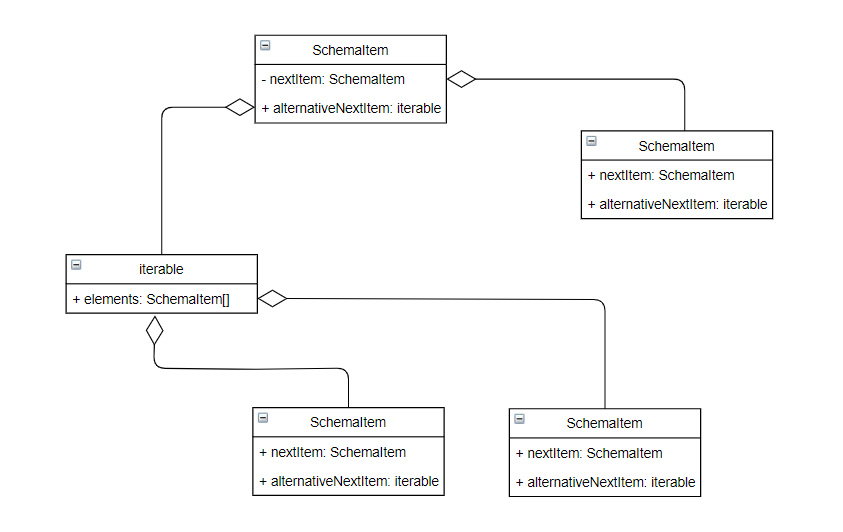

# Process
### General description
This solution is intended to describe the process flowchart.
You describe a block diagram that can be further documented from code.
You describe the logic of your business tasks in domain services and connect them to process nodes using decorators.

This solution is based on psr / container and psr / event-dispatcher.

### Concept
Activity chart:


You register the specific activity in the psr / container and pass the service identifier to the process node.
Subsequently, the process node will request a service from the container and call it.

Process configuration example:
```
$configuration = [
    'name' => 'Test',
    'activities' => [
        [
            'name' => 'item1',
            'activityId' => 'item1Handler',
            'isInitial' => true,
        ],
        [
            'name' => 'item2',
            'activityId' => 'item2Handler',
        ],
        [
            'name' => 'item3',
            'activityId' => 'item3Handler',
        ],
        [
            'name' => 'item4',
            'activityId' => 'item4Handler',
        ],
        [
            'name' => 'item5',
            'activityId' => 'item5Handler',
        ],
        [
            'name' => 'item6',
            'activityId' => 'item6Handler',
        ],
        [
            'name' => 'item7',
            'activityId' => 'item7Handler',
        ],
    ],
    'flows' => [
        [
            'activityFromName' => 'item1',
            'activityToName' => 'item2'
        ],
        [
            'activityFromName' => 'item2',
            'activityToName' => 'item3'
        ],
        [
            'activityFromName' => 'item2',
            'activityToName' => 'item4',
            'isAlternative' => true,
        ],
        [
            'activityFromName' => 'item4',
            'activityToName' => 'item5',
        ],
        [
            'activityFromName' => 'item2',
            'activityToName' => 'item6',
            'isAlternative' => true,
        ],
        [
            'activityFromName' => 'item6',
            'activityToName' => 'item7',
        ],
    ],
]
```

The configuration describes the nodes (activities) and transitions (flows).

Each node contains *name* (name node), *activityId* (activity service identifier in the container) and the *isInitial* flag (whether this node is the initial node in the process diagram, optionally false).
The *name* option in node configuration is important for graphically illustrating a process diagram

Each flow contains *activityFromName* (activity name in configuration) and the *activityToName* (activity name in configuration) and *isAlternative* flag (whether this flow an alternative, optionally false).
Configuration flows is necessary for the synthesis of each node in the process diagram.

Alternative flows are controlled by throwing an exception *AlternativeFlowException* in the activity service. The exception thrown must contain the name of the alternative activity.

*SchemaItem* chart:




The above process configuration can be visualized as follows:


